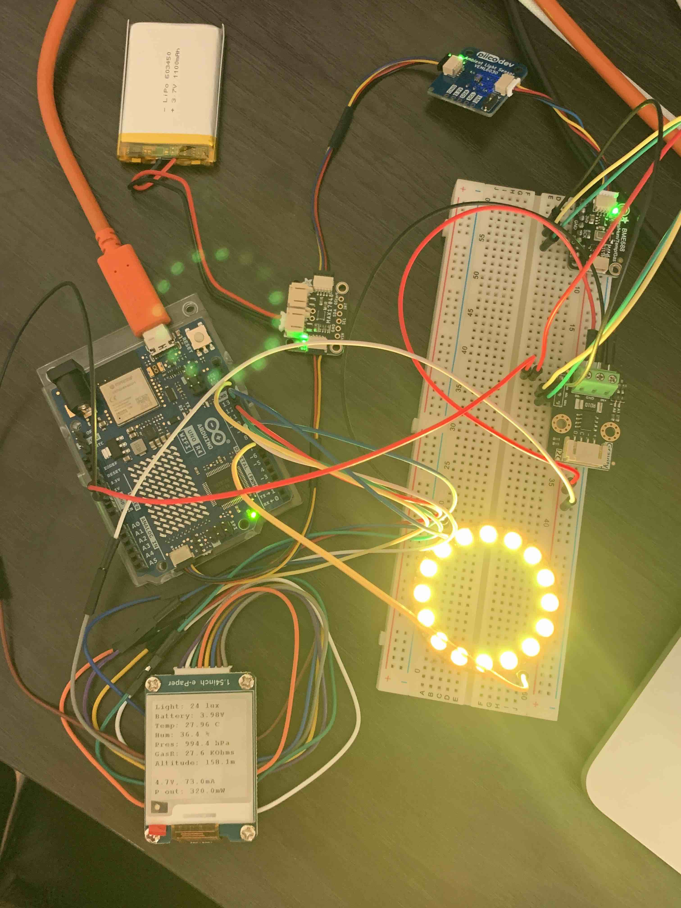
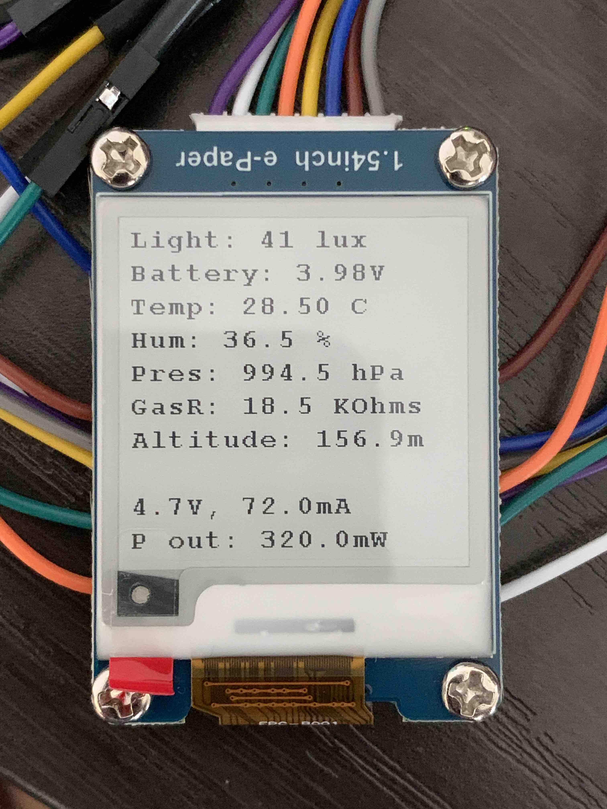

# Arduino R4 Qwiic Devices Demo

This is a demo code to show modifications required to use I2C devices through the Qwiic port on the newer Arduino R4 boards.

## Prerequisites
- Arduino R4
- Waveshare 1.54 inch E-paper display
- Adafruit MAX17048 LiPo Battery Monitor
- SparkFun/Piicodev VEML6030 Ambient Light Sensor
- Adafruit BME688 - Temperature, Humidity, Pressure and Gas Sensor
- DFRobot Gravity I2C Digital Wattmeter - INA219
- Adafruit NeoPixel Ring Light

## Software libraries

**From Arduino library manager:**

- Adafruit BME680
- SparkFun Ambient Light Sensor - VEML6030
- Adafruit MAX1704X

**Included in this repo:**

- Waveshare 1.54inch V2 E-paper display [[original docs]](https://www.waveshare.com/wiki/1.54inch_e-Paper_Module_Manual#Working_With_Arduino)
- DFRobot_INA219 SKU: SEN0291 (modified to support Qwiic) [[original lib]](https://github.com/DFRobot/DFRobot_INA219)
